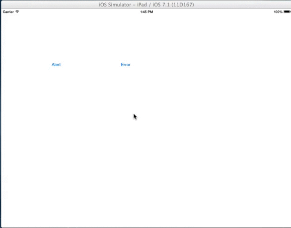

UIXExpandableMessage
====================

A view controller for a message that can be expanded to show detail and allow mailing the detail



#Usage

UIXExpandableMessage is intended to be as simple to use as UIAlert.  There are two factory methods:

```objectivec
\+ (UIXExpandableMessageController*) messageWithTitle:(NSString *)title shortMessage:(NSString *)message detail:(NSString*) detail;

\+ (UIXExpandableMessageController*) messageWithError:(NSError *)error additionalDetail:(NSString*) detail;
```

`messageWithError` takes an NSError and uses `error.localizedDescription` as the short message and uses the standard description string as the detail message.

`messageWithTitle` allows for user specified message contents

Displaying the message is similar to UIAlert, using a `show` method:

```objectivec
\- (void) show;
```

\- (void) messageDidDismiss:(UIXExpandableMessageController*) expandableMessageController;
\- (void) messageDidExpand:(UIXExpandableMessageController*) expandableMessageController;
\- (void) messageDidSelectEmail:(UIXExpandableMessageController*) expandableMessageController;

##Properties

```objectivec
@property (nonatomic, copy) NSString* emailSubject;  //subject line value for email sent from UIXExpandableMessage

@property (nonatomic, copy) NSArray* emailRecipients; //array of email address to send the email to (the "To" receipents)
```

##Delegate
@end

@interface UIXExpandableMessageController : UIViewController <MFMailComposeViewControllerDelegate>


@property (nonatomic, assign) NSObject<UIXExpandableMessageViewDelegate>* expandableMessageDelegate;

